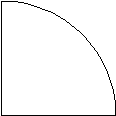
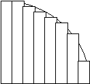
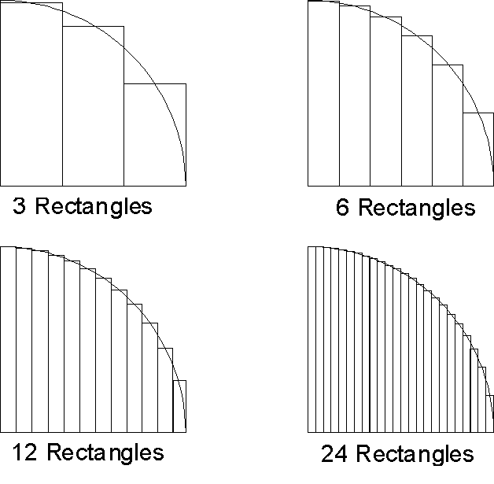

# Calculating Pi

> * The PiCalc.circle method requires about 10 statements.
> * The PiCalc.leibniz method requires about 6 statements.
>
> (This does not count variable declarations, comments, or curly braces.)

There is a sample [Driver.java](Driver.java) provided for you to start from and experiment with.

When you have Java installed on your development system, at your shell you can test your program
with the command:
```bash
javac Driver.java && java Driver
```

Remember, if there are syntactic errors in your program, you'll get error messages and your program
won't run. You can try your program with different numbers of iterations with a command-line
parameter:

```bash
javac Driver.java && java Driver 1000
```

## The Circle Method
_Sort of like [Riemann sums](http://en.wikipedia.org/wiki/Riemann_sum)_

Consider the quarter circle. Assume the circle has a radius $r$ of length 2.
(Having a radius of 2 is important.)



The formula for the area of a circle along with our assumption about radius:

$$ Area = \pi * r^2 $$

$$ r = 2 $$

$$ Area = 4 * \pi $$

Seen above, we can easily determine algebraically that the area of this quarter circle is $\pi$
square units. You can also approximate the area computationally by adding up the areas of a series
of rectangles. Each rectangle has a fixed width and the height is chosen so that the circle passes
through the midpoint of the top of the rectangle. For example:



We can easily see how we can get a closer approximation by increasing the number of rectangles and
at the same time, making the rectangles thinner:



As the number of rectangles goes to infinity and the width goes to zero, we get the value for $\pi$.

For each rectangle, the width, $w$, is the same, derived by dividing the radius of the circle by the
number of rectangles. The height, $h$, on the other hand, varies depending on the position of the
rectangle. Rectangles closer to the center of the circle will be taller than those near the edge.
If the midpoint of the rectangle in the horizontal direction is given by $x$, then the height of the
rectangle can be computed using the distance formula:

$$
h = \sqrt{r^2 - x^2}
$$

The sum of the areas of the rectangles provides an approximation to the area of the quarter circle, 
hence, it is also an approximation of pi. 
The more rectangles there are, the closer the approximation.

Here are some results, using a small number of iterations:
```
Approximations for pi
Iterations      Circle Method   Leibniz Method
----------------------------------------------
         1      3.464101615138  4.000000000000
         2      3.259367328636  2.666666666667
         3      3.206412665814  3.466666666667
         4      3.183929220612  2.895238095238
         5      3.171987823613  3.339682539683
         6      3.164766816537  2.976046176046
         7      3.160012188321  3.283738483738
         8      3.156686931298  3.017071817072
         9      3.154254281272  3.252365934719
        10      3.152411433262  3.041839618929
```

Using a lot of iterations:
```
Approximations for pi
Iterations      Circle Method   Leibniz Method
----------------------------------------------
         1      3.464101615138  4.000000000000
        10      3.152411433262  3.041839618929
       100      3.141936857900  3.131592903559
      1000      3.141603544913  3.140592653840
     10000      3.141592998025  3.141492653590
    100000      3.141592664482  3.141582653590
   1000000      3.141592653934  3.141591653590
```

### Pseudo-code for finding the area under the quarter-circle

For each iteration:
 1. Calculate the midpoint of the current rectangle.
    * ⚠ Don't use the previous value and add to it, this is what gives you too many rounding
      errors, resulting in incorrect output. Note the last few digits of the values above for the
      100,000 and 1,000,000 iteration cases.
 2. Calculate the new height based on the radius and midpoint.
 3. Calculate the area of the new rectangle using height and width.
 4. Add the area of the new rectangle to the total area.

Notice that the width of each rectangle is the same, so you should not be calculating
the width inside the loop. Just calculate it once before the loop and then use it in the loop.

## On the imprecision of floating-point arithmetic

One of the "interesting" features of floating point numbers (sometimes referred to as real numbers)
is that the computer cannot represent all of them exactly. If I asked you to write out the exact
decimal notation for 1/3, you couldn't. There is an infinite number of threes after the decimal
point in that number. Well, the computer doesn't have an infinite set of memory either. So, what to
do? Well, the computer will approximate the real values. These approximations are close, but they
are not exact. These approximations introduce errors into the calculations. Usually, this isn't a
big deal.  But, if you introduce many, many errors into the calculations, you will start to notice
them.

Here's the idea and a way to fix it. If I have this:

```java
double x = 1.0 / 3.0;
```

both of these expressions are _supposed_ to compute the same value:
```java
x + x + x + x + x + x
6 * x
```

However, since the value of x is probably not exact (rounding errors), each time I add it, I
introduce a little more rounding error. If I multiply it, I still introduce the error, but only
once. If you add enough x's together, you will see that the value diverges from the value you get by
multiplying once.

Also note that this loop has the same problem though you may be fooled into thinking that you aren't
adding x over and over again:

```java
double total = 0;
for (i = 0; i < 6; i++)
  total += x;
```

Here's a sample program that demonstrates the differences: 

```java
int count;
for (count = 10; count <= 100000000; count *= 10)
{
  double x = 1.0 / count;
  double multiplied = x * count;
  double added = 0;
  int i;

  for (i = 0; i < count; i++)
    added += x;

  System.out.printf("iterations: %i, x = %.8f\n", count, x);
  System.out.printf("    multiplied = %.14f\n", multiplied);
  System.out.printf("         added = %.14f\n", added);
  System.out.prinln();
}
```
```
iterations: 10, x = 0.10000000
    multiplied = 1.00000000000000
         added = 1.00000000000000

iterations: 100, x = 0.01000000
    multiplied = 1.00000000000000
         added = 1.00000000000000

iterations: 1000, x = 0.00100000
    multiplied = 1.00000000000000
         added = 1.00000000000000

iterations: 10000, x = 0.00010000
    multiplied = 1.00000000000000
         added = 0.99999999999991

iterations: 100000, x = 0.00001000
    multiplied = 1.00000000000000
         added = 0.99999999999808

iterations: 1000000, x = 0.00000100
    multiplied = 1.00000000000000
         added = 1.00000000000792

iterations: 10000000, x = 0.00000010
    multiplied = 1.00000000000000
         added = 0.99999999975017

iterations: 100000000, x = 0.00000001
    multiplied = 1.00000000000000
         added = 1.00000000228987
```

If you are getting incorrect values when approximating the value of pi above, it may be because you
are adding small amounts during each iteration, causing the errors to grow.
